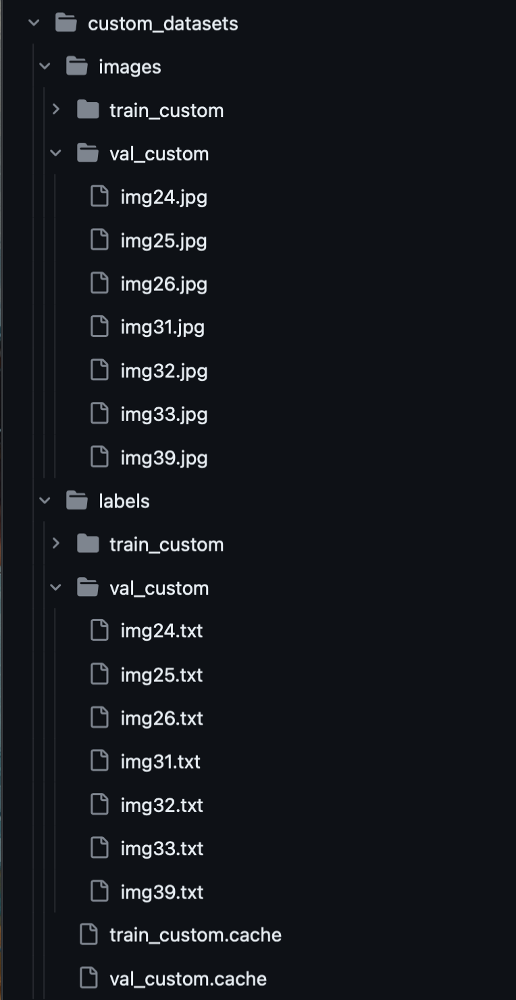

# Custom object detector

This tutorial explains how to manually create a dataset with Labelme and then convert it to the correct format in order to train the YOLOv5 object detection model.

## Annotations
To start, choose 2-5 classes of objects that you want to detect. Around 30-50 images will be fine for a small dataset, which will be used to train the model later. It will be helpful to rename each image to something simple to easily go through them later. The objects in the images should be relatively high definition (at least recognizable).

For the examples in this tutorial, four classes were chosen: Person, Car, Motorcycle, and Bus. Here's an example of an image chosen with some of the classes:


The rest of the images used in this tutorial can be found [here](https://github.com/brookshu/custom-object-detector/tree/main/annotations/JPEGImages).

Next, download [Labelme](https://github.com/wkentaro/labelme/tree/main), which will be the tool used to create annotations. Under _Releases_ (below _About_ on the right side), select the latest version and download the correct version. This tutorial uses v5.3.0.

In each image, create polygons around each object in the photo. This can be done manually with the polygon tool, but the AI-polygon tool can help speed things up. The polygons should look like those in the following image. Be consistent with labeling cut-off objects (label all or label none).


After creating the polygon, the window in the following image will pop up. Put the class name as its label. Use group ID if the object is split by another object or the background. Two polygons having the same group ID will count as the same object. Otherwise, do not enter it. No label description is needed. As you can see in the image below, there are two *car (1)* polygons under polygon labels, because the car is separated by the pole, so 1 is used as a group ID for both parts.


After saving each image, a new .json file should pop up (per image) in the same folder as your images. It should contain information on the polygons you just created.

## Converting Labelme to JSON/COCO format

To start, convert from the Labelme format to JSON format using [`convert_labelme.py`](https://github.com/brookshu/custom-object-detector/blob/f2b5493bfc3f14f3a04595154d666bdab83e979c/convert_labelme.py) (a link to the [original](https://github.com/wkentaro/labelme/blob/main/examples/instance_segmentation/labelme2coco.py)).

This code takes three arguments using the `argparse` library: a path to the directory with .json files from Labelme, a path to an output directory, and the path to [`labels.txt`](https://github.com/brookshu/custom-object-detector/blob/49152dd56aaeee393c6a864a248bc40bd2345d9d/labels.txt), which should have a list of the classes you are using. The class names should be the same as the labels in labelme.

Example run code:
```
python3 /Users/brookshu/Documents/convert_labelme.py /Users/brookshu/Desktop/annotate/ /Users/brookshu/Desktop/annotate_output --labels /Users/brookshu/Documents/labels.txt
```

The output should be a [folder](https://github.com/brookshu/custom-object-detector/tree/9725705cff8a98b8b320a7b6a507d6602bbb3dab/annotations) with an `annotations.json` file in addition to two directories, called Visualization and JPEGImages. Visualizations should contain JPEGs of each image with the polygons you annotated around the objects as well as the class name and a bounding box. You can use these images to make sure your polygons and labels look correct. JPEGImages should just be a folder with each image as a JPEG and no annotations. Below is an example of an image from the Visualizations folder.


## Converting from JSON/COCO to YOLO format

Then, convert the annotations.json file into the YOLO format using [`general_json2yolo.py`](https://github.com/brookshu/custom-object-detector/blob/49152dd56aaeee393c6a864a248bc40bd2345d9d/general_json2yolo.py), since we'll be training a YOLO model. 

A couple of changes have been made from the [original](https://github.com/ultralytics/JSON2YOLO/blob/c38a43f342428849c75c103c6d060012a83b5392/general_json2yolo.py):

- L386 - L402 are commented out (not necessary, since the input format is known as COCO)

- the name of the directory with `annotations.json` (input file) in L389 was changed

- `use_segments` in L388 was changed to  `False`

- `cls91to80` in L389 was changed to `False`, because the label id does not need to be changed

The output should show up in a folder called [new_dir](https://github.com/brookshu/custom-object-detector/tree/018ee6066c6b14a3f0e7f286ab078e94e03368b0/new_dir).  new_dir/labels/annotations/JPEGImages should contain a .txt file for every image that has been annotated. Each .txt file should contain one line per object, in the format: 

[class id] [x center ratio] [y center ratio] [width ratio] [height ratio]

## Organizing the folders for training
To start, clone the the yolov5 folder from ultralytics and install the `requirements.txt`:
```
git clone https://github.com/ultralytics/yolov5  # clone 
cd yolov5 
pip install -r requirements.txt  # install  
```



Then, create a folder for the dataset in the same directory as yolov5. Within it, create two more folders: images and labels. Within each of those folders, there should be training and validation folders, with images in each. Format all images as JPEGs (the results in JPEGImages from the Labelme to JSON conversion program can be used). Corresponding image and .txt files should be in the same section (i.e. if `img1.jpg` is in images/validation/, `img1.txt` should be in labels/validation/). A good rule is to split the images you have 80-20, training and validation. See the image on the right from [custom_datasets](https://github.com/brookshu/custom-object-detector/tree/88f645ec5db8915deaf3a0cbe9c164f970e5c2e5/custom_datasets) for an example (ignore `train_custom.cache` and `val_custom.cache`). 

Lastly, create a .yaml file in yolov5/data/. It should look similar to [`coco128.yaml`](https://github.com/brookshu/custom-object-detector/blob/main/yolov5/data/coco128.yaml), with a path to the dataset root directory, and paths to folders with training and validation images relative to that. It should also have class names and numbers (use the numbers in the .txt files). See [`dataset.yaml`](https://github.com/brookshu/custom-object-detector/blob/main/yolov5/data/dataset.yaml).

## Training the model

Run train.py (in yolov5 folder). Be sure to add your .yaml file as an argument. Some optional arguments include --batch and --epochs (See [L444](https://github.com/brookshu/custom-object-detector/blob/88f645ec5db8915deaf3a0cbe9c164f970e5c2e5/yolov5/train.py#L444) for more).

Example code to run with 4 batches, one epoch: 
```
python3 train.py --batch 4 --epochs 1 –dataset.yaml
```

## Results
Results will show up in yolov5/runs/train. Each time you run `train.py` run, there will be a new exp# folder, containing statistics like precision-confidence, recall-confidence, and PR curves as well as a confusion matrix and how well the model performed on the validation images.

Here is an example of the resulting performance on the image I showed previously after some hundred epochs:


## Acknowledgements

[Labelme](https://github.com/wkentaro/labelme/tree/main) and [labelme2coco.py](https://github.com/wkentaro/labelme/blob/main/examples/instance_segmentation/labelme2coco.py) is from [wkentaro](https://github.com/wkentaro).

[general_json2yolo](https://github.com/ultralytics/JSON2YOLO/blob/c38a43f342428849c75c103c6d060012a83b5392/general_json2yolo.py) and [yolov5](https://github.com/ultralytics/yolov5) is by [ultralytics](https://github.com/ultralytics).
