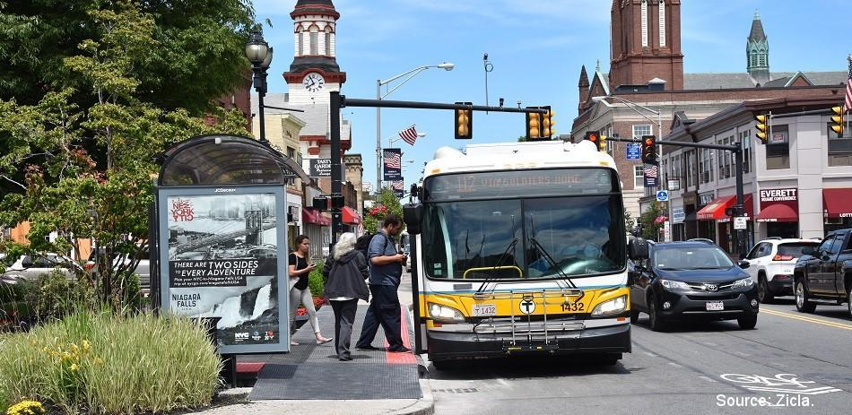

# Custom object detector

This tutorial will teach you how to manually create a dataset with Labelme and then convert it to the correct format in order to train the YOLOv5 object detection model.

## Annotations
To start, choose 2-5 classes of objects that you want to detect. You will need to choose around 30-50 images, which will be used to train the model later. It will be helpful to rename each image to something simple to keep track and easily go through them later. The objects in the images should be relatively high definition (at least recognizable), and be consistent with labeling cut-off objects (label all or label none).

The classes I chose were Person, Car, Motorcycle, and Bus. Here's an example of an image that I chose:



Next, download [Labelme](https://github.com/wkentaro/labelme/tree/main). This will be the tool used to create annotations.

In each image, create polygons around each object in the photo. It can be done manually with the polygon tool, but the AI-polygon tool can help speed things up.


After creating the polygon, the following window will pop up. Label them as the class name. Two polygons having the same class ID will count as the same object, so this can be used if another object or the background splits the object in half. Otherwise, do not enter a class ID.


After saving each image, a .json file should pop up in the same folder as your images with information on the polygons you just created.

## Converting Labelme to JSON/COCO format

To start, we'll convert from the Labelme format to JSON format

https://github.com/brookshu/custom-object-detector/blob/f2b5493bfc3f14f3a04595154d666bdab83e979c/convert_labelme.py

This code takes three arguments with `argparse`: a path to the directory with .json files from Labelme, a path to an output directory, and the path to [labels.txt](https://github.com/brookshu/custom-object-detector/blob/49152dd56aaeee393c6a864a248bc40bd2345d9d/labels.txt), which should have a list of the classes you are using.

A couple changes were made from the [original](https://github.com/wkentaro/labelme/blob/main/examples/instance_segmentation/labelme2coco.py). ?

Output should be a [folder](https://github.com/brookshu/custom-object-detector/tree/9725705cff8a98b8b320a7b6a507d6602bbb3dab/annotations) with annotations.json file and Visualization and JPEGImages directory. Visualizations should contain JPEGs of each image with the polygons you annotated around the objects as well as the class name (see image below). JPEGImages should just be a folder with each image as a JPEG and no annotations.


## Converting from JSON/COCO to YOLO format

Then, we can convert the annotations.json file into the YOLO format using [`general_json2yolo.py`](https://github.com/brookshu/custom-object-detector/blob/49152dd56aaeee393c6a864a248bc40bd2345d9d/general_json2yolo.py), since we'll be training a YOLO model. 

A couple of changes have been made from the [original](https://github.com/ultralytics/JSON2YOLO/blob/c38a43f342428849c75c103c6d060012a83b5392/general_json2yolo.py#L386-L389):

- L386 - L402 are commented out (not necessary, since the input format is known)

- the name of the directory with annotations.json (input file) in L389 was changed

- `use_segments` in L388 was changed to  `False`

- `cls91to80` in L389 was changed to `False`

The output should show up in a folder called [new_dir](https://github.com/brookshu/custom-object-detector/tree/018ee6066c6b14a3f0e7f286ab078e94e03368b0/new_dir). If you navigate within that to new_dir/labels/annotations/JPEGImages, you should see a .txt file for every image you've annotated. In each .txt file you should see one line per object, in the format [class_num] [x center ratio] [y center ratio] [width ratio] [height ratio].

## Organizing the folders for training
To start, clone the the yolov5 folder from ultralytics and install the requirements.txt:
```
git clone https://github.com/ultralytics/yolov5  # clone 
cd yolov5 
pip install -r requirements.txt  # install  
```
Then, create a folder in the same directory as yolov5. It should have two folders within it: images and labels. Within each folder, there should be training and validation folders, with images in each. Corresponding image and .txt files should be in the same section (i.e. if img1.jpg is in images/validation/, img1.txt should be in labels/validation/). See how my [custom_datasets](https://github.com/brookshu/custom-object-detector/tree/88f645ec5db8915deaf3a0cbe9c164f970e5c2e5/custom_datasets) folder is organized for an example.

Lastly, create a .yaml file in the data folder. It should look like `coco128.yaml`, with a path to the dataset root directory, and paths to folders with training and validation images relative to that. It should also have class names and numbers (use the numbers in the .txt files). Mine is called [`dataset.yaml`](https://github.com/brookshu/custom-object-detector/blob/main/yolov5/data/dataset.yaml).

## Training the model

Run train.py (in yolov5 folder). Be sure to add your .yaml file as an argument. Some optional arguments include --batch and --epochs (See [L444](https://github.com/brookshu/custom-object-detector/blob/88f645ec5db8915deaf3a0cbe9c164f970e5c2e5/yolov5/train.py#L444) for more).

Example: `python3 train.py --batch 4 --epochs 1 –dataset.yaml`

## Results
Results will show up in yolov5/runs/train. For each run, there will be an exp# folder, with statistics like precision-confidence, recall-confidence, and PR curves as well as a confusion matrix and how well the model performed on the validation images.

Here is an example of the resulting performance on the image I showed previously:


